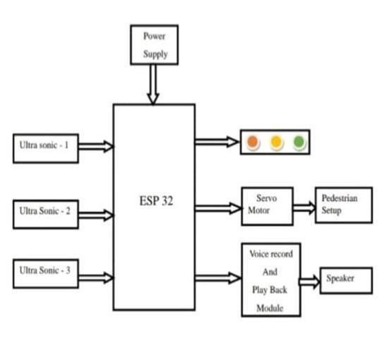
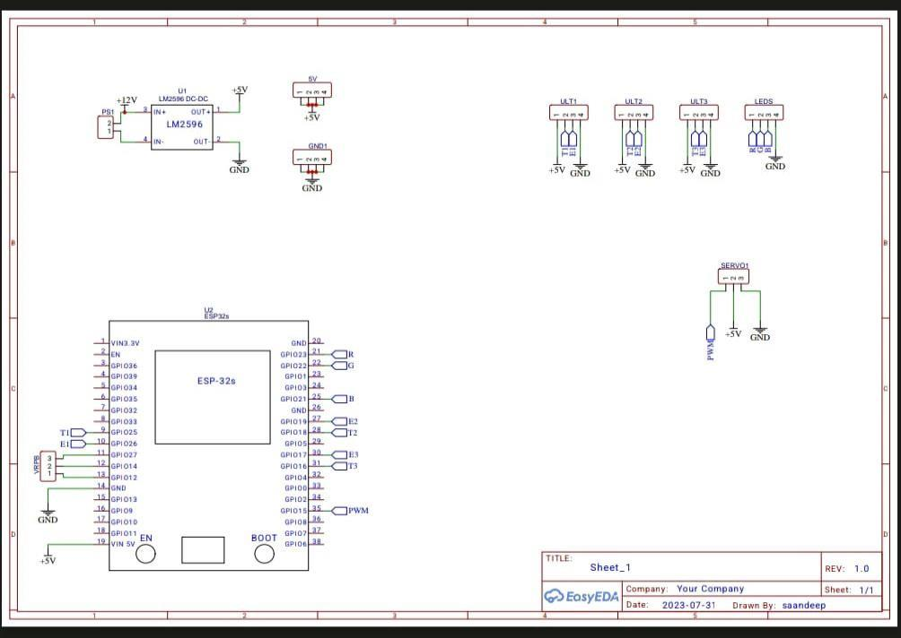
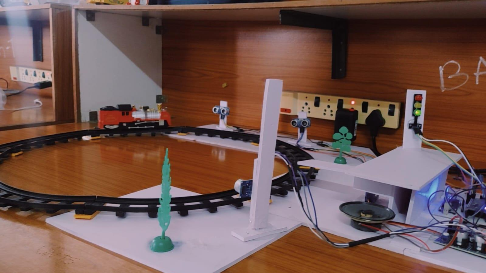
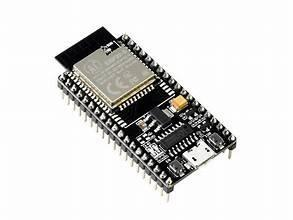
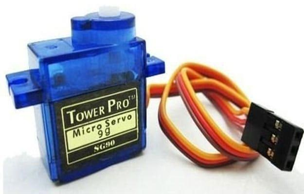

# 🚦 Smart Voice-Assisted Pedestrian Crossing System with Signal Detection

## 📌 Overview
A **smart pedestrian crossing system** designed using an **ESP32 microcontroller, ultrasonic sensors, servo motor, and IoT integration (Blynk App)**.  
The system improves **safety and accessibility** at pedestrian crossings by automatically detecting movement, controlling barriers, and giving **voice-assisted guidance**.  

---

## 🎯 Features
- 🚦 Automatic traffic signal & barrier control  
- 🎙️ Voice guidance for elderly and differently-abled pedestrians  
- 📡 Real-time IoT monitoring via **Blynk App**  
- ⚡ Servo-controlled crossing platform  
- 🛠️ Low-cost, energy-efficient, and scalable  

---

## 🛠️ Hardware Components
- ESP32 Microcontroller  
- Ultrasonic Sensors (HC-SR04)  
- Servo Motor  
- LM2596 DC-DC Converter  
- Voice Playback Module (ISD1820) + Speaker  
- LEDs (Red, Yellow, Green)  

---

## 💻 Software Tools
- Arduino IDE  
- Blynk IoT App  

---

## ⚙️ Working Principle
1. Ultrasonic sensors detect **pedestrian or train movement**.  
2. ESP32 processes signals and controls the **servo motor** + **LED indicators**.  
3. Voice module announces safe crossing instructions.  
4. IoT notifications sent to **Blynk App** for remote alerts.  

---

## 📸 Diagrams & Prototype

### Block Diagram  

### Circuit Schematic  

### Prototype  
  
  
  

---

## 📊 Applications
- Railway station pedestrian crossings  
- School zones and urban crosswalks  
- Public transport hubs  
- Accessibility-focused areas (elderly/disabled support)  
- Smart city traffic management  

---

## ✅ Advantages
- Enhances **pedestrian safety**  
- Provides **voice guidance** for accessibility  
- IoT-enabled **remote monitoring**  
- Reduces need for manual supervision  
- Energy-efficient and practical  

---

## 🚀 Future Scope
- AI-based signal prediction for smarter crossings  
- Integration with **urban traffic control systems**  
- Solar-powered operation for energy independence  

---

